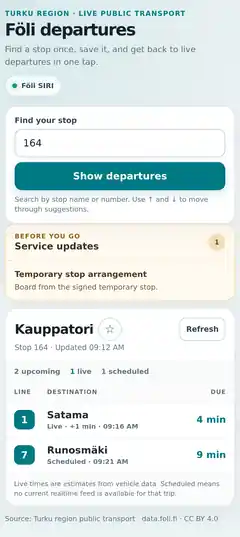

# Föli Live Departures

A fast, local-first departure companion for Turku-region public transport. It is optimized for the everyday question:

> **When does my next bus leave — and is there anything I need to know before I go?**

  

  

These screenshots are generated from the same deterministic Playwright flow that runs in CI.

For the adversarial product review, scores, fixed risks and deliberately unresolved limitations, see **[docs/PRODUCT_AUDIT.md](docs/PRODUCT_AUDIT.md)**.

## Daily workflow

1. Save **Home, School or Work** once as a **Safe Arrival Zone** made from 1–3 public Föli stops — no private address required.
2. When Home exists, the top of the app exposes **Get me Home** as a dedicated travel-recovery action for a child, newcomer or anyone who is lost or unsure.
3. **Get me Home** opens public-transit directions to the primary safe Home stop. The app does not embed the user's current origin.
4. Recovery keeps independent fallbacks: **Open Home stop** for the departure board, **Show driver** for a simple destination card, and **Prepare for no battery** for a printable public-stop-only Home backup card. Saved backup Home stops stay available behind an explicit disclosure.
5. Tap **Go Home / Go to School / Go to Work** in My Places for the normal daily destination flow.
6. If location access is unavailable, search/select a stop normally and save that public stop to My Places.
7. Tap **Find nearest stop** for a one-time location lookup, or search by **stop name / stop number**.
8. Compare the three closest stops and their approximate straight-line distances when direction matters, then tap **Walk there** for walking directions.
9. See active **stop- and route-level disruptions, cancellations, global notices, and emergency messages before departures**.
10. Scan line, destination, due time, realtime status, official Föli route identity, and — when available — the live vehicle's approximate distance from the stop.
11. Save frequent stops with **☆** and return to favorites or recent stops in one tap.

No account, backend, or tracking is required. Favorites, recents and My Places stay in the browser. My Places stores public stop IDs/names only; the exact location used during setup is discarded. Location is requested only after a user action.

## Product decisions

- **Get me Home** is deliberately surfaced above stop search after Home is configured, because a recovery action should not be buried inside settings or a long page
- recovery uses one dominant action plus independent **Open Home stop** and **Show driver** fallbacks rather than a multi-step wizard
- recovery is explicitly labelled as travel help, not an emergency service; the UI avoids red/SOS styling that could imply capabilities it does not provide
- if GTFS stop coordinates are temporarily unavailable, transit routing is disabled rather than pretending it can route; the saved public stop and driver card still work
- parent-approved backup Home stops remain hidden until requested, reducing cognitive load while preserving resilience when the usual stop is unavailable
- **Prepare for no battery** produces a printable/save-as-PDF Home card containing only public stop identity and the Finnish help sentence; this is the only fallback that remains usable after the phone itself powers off
- Safe Arrival setup selects only the closest candidate initially; extra backup stops require explicit opt-in because physical proximity alone does not make a stop safe
- **My Places** replaces memorized private addresses with intent-based destinations such as Home, School and Work
- each place is a **Safe Arrival Zone** of up to three public Föli stops; one is primary and the others are backups
- setup by **where I am now** uses one-time geolocation only to discover nearby public stops, then discards the exact position
- a no-geolocation fallback lets the user search/select a stop and save that public stop directly
- **Go Home / Go to School / Go to Work** launches keyless transit directions to the primary public stop with no origin embedded in the URL
- **Show driver** provides a large stop-focused destination card plus a simple Finnish help sentence
- when browser speech synthesis is available, **Read aloud in Finnish** speaks the driver-help sentence locally without an AI service or backend
- a parent/teacher can **Share Home / School / Work** without an account; the link contains only the Safe Arrival stop identity
- public stop identity is less sensitive than an exact address but is **not anonymous**: a Home/School/Work stop can reveal the general area, so share/import/print flows say this explicitly
- shared Safe Places use a URL fragment rather than a query parameter, so the share payload is not sent to the web server as part of the HTTP request
- opening a shared place never overwrites local data automatically: the recipient must explicitly Add or Replace it
- place editing/removal is kept behind Manage instead of exposing destructive controls in the main child-friendly flow
- one-tap geolocation removes the need to know a nearby stop's name or number
- the closest stop is selected automatically only when location quality is reasonable, the device is near the Föli network, and one candidate is meaningfully closer than the next
- the three nearest alternatives remain visible because the physically closest stop may serve the wrong travel direction
- location accuracy is exposed instead of pretending GPS/Wi-Fi positioning is exact
- stop distances are labelled as approximate straight-line distances rather than walking-route distances
- each nearby stop can open keyless walking directions in Google Maps without bundling a map SDK
- user coordinates are never stored and there is no background location tracking
- stop-name search removes the need to remember numeric stop IDs
- search tolerates partial names and missing Finnish diacritics
- keyboard autocomplete supports ↑ / ↓ / Enter / Escape
- favorites optimize repeated commute flows
- recent stops recover common journeys automatically
- stop-specific and route-specific service messages appear before the board
- global Föli notices are included and emergency messages replace lower-priority disruption content
- semantic alert effects such as Detour, Stop moved, Significant delays and No service are surfaced directly
- detailed alert information stays collapsed until the user asks for it
- the first four alerts preserve a low-noise default, while additional relevant updates are explicitly discoverable through **Show N more updates**
- official GTFS route colors and names improve line recognition without hard-coded branding
- route text colors are contrast-checked at runtime and corrected when the provider color pair would fail WCAG AA
- monitored SIRI vehicle coordinates are converted into an approximate vehicle-to-stop distance
- proximity is labelled **nearby**, not “approaching”, because distance alone cannot prove the vehicle's travel direction
- already-departed rows and rows without a usable departure timestamp are filtered instead of being presented as current departures
- line, destination, and due time remain the strongest visual hierarchy
- the live departure board appears before My Places management in the normal flow; shared-place import is the context-aware exception because confirmation is then the user's immediate task
- mobile controls use large touch targets and collapse into a simple one-column action flow
- loading, empty, stale, scheduled, realtime, and failed states are explicit
- the receipt time of the last successful realtime payload is tracked separately from Föli server time, so a failed refresh cannot freeze an old payload in a misleadingly fresh **Live** state
- Due-time filtering, vehicle-position freshness and realtime status all age forward across an outage using the last successful provider clock plus elapsed client time
- service-alert feed failures are also explicit: retained alerts remain visible, but an old/failed disruption check is labelled with when it was last confirmed
- a temporary refresh failure keeps the last successful same-stop data
- data from one stop can never render under another stop number
- the app shell can be installed as a PWA; the production build generates a content-versioned precache for same-origin assets while live Föli API responses are never cached
- offline mode is explicit: saved Safe Places and driver help remain available, while live departures and external route planning are labelled as network-dependent
- the header changes from the normal Föli status indicator to **Offline mode**, avoiding contradictory “live-looking” UI while the browser reports no network

## Location semantics

Föli GTFS provides WGS84 stop coordinates through `stop_lat` and `stop_lon`. SIRI stop search and GTFS coordinates are fetched independently: stop-name/number search can become usable as soon as SIRI responds, while coordinates enrich the cached catalogue asynchronously.

When the user taps **Find nearest stop**:

1. the browser asks for location permission
2. the app requests a high-accuracy one-time position, with a lower-power timeout fallback
3. distances are calculated locally with the Haversine formula
4. the three nearest active Föli stops are ranked
5. the nearest stop is auto-selected only when:
   - reported location accuracy is at most 250 m,
   - the nearest stop is within 10 km, and
   - the second-nearest candidate is not effectively tied within the uncertainty margin
6. poor accuracy, an unexpectedly distant network result, or two nearly tied stops is surfaced as a warning instead of silently making a strong assumption

No map SDK, geocoding service, analytics service, or location backend is required. **Walk there** uses a standard Google Maps URL with only the public stop destination; the app does not put the user's current coordinates into the external URL.

## Realtime semantics

Föli Stop Monitoring exposes both planned and estimated times. The board uses this defensive order:

~~~text
expecteddeparturetime
→ expectedarrivaltime
→ aimeddeparturetime
→ aimedarrivaltime
~~~

A vehicle is labelled **Live** only when `monitored === true`. Otherwise the trip is shown as **Scheduled**.

Rows without a usable departure timestamp are ignored. Departures older than a short grace window are also removed so an already-departed vehicle cannot linger indefinitely as **Due**.

The hook records when each successful Stop Monitoring payload actually reaches the browser. Föli `servertime` is then advanced by the elapsed time since that receipt. This means a retained payload continues to age during an outage instead of freezing at the age it had when the last response arrived.

`recordedattime` is compared with that advancing provider-time reference. Due labels, vehicle-position age and **Live data · N min old** semantics therefore remain conservative even while retries fail.

The UI intentionally treats realtime values as estimates rather than promises. Vehicle coordinates are presented as **nearby / distance from stop** rather than “approaching”, because the stop-monitoring position alone does not prove direction of travel.

## Architecture

~~~text
Föli SIRI + GTFS Stops/Routes + Alerts APIs
        ↓
api/foliApi.js
  normalize provider data
  keep monitored SIRI vehicle coordinates
  normalize GTFS stop + route metadata
        ↓
hooks/
  useStopMonitor.js   30s visible-tab polling + cancellation + stale-data safety
  useStopCatalog.js   non-blocking SIRI catalogue + async GTFS enrichment
  useRouteCatalog.js  cached route identity/colors for line recognition + alerts
  useSavedStops.js    local-first favorites + recents
  useSavedPlaces.js   privacy-first Home / School / Work safe-stop zones
  useStopAlerts.js    conservative active-disruption polling
  useOnlineStatus.js  explicit browser online/offline state
        ↓
App.jsx
        ↓
ConnectivityStatus.jsx explicit degraded/offline capability messaging
HomeRecovery.jsx     top-level one-tap Home recovery + backup safe-stop fallbacks
SafePlaceDriverCard.jsx shared child/newcomer driver-assistance card
BusStopForm.jsx       search / accessible autocomplete
NearbyStops.jsx       one-time geolocation / nearest-stop ranking / walking handoff
MyPlaces.jsx          Safe Arrival Zones + transit handoff + explicit share/import
QuickStops.jsx        favorites / recents
ServiceAlerts.jsx     stop + route disruptions / emergency + global notices
BusStopDisplay.jsx    live departure board + route identity + vehicle proximity
        ↓
utils/
  geo.js              Haversine distance + nearest-stop + vehicle distance
  routes.js           route indexing + WCAG-safe route text color
  maps.js             keyless privacy-conscious walking + transit URLs
  location.js         shared one-time geolocation + timeout fallback semantics
  sharedPlaces.js     validated public-stop-only share fragment codec
  time.js             timing + freshness semantics
  alerts.js           pure alert filtering

build-time/
  scripts/build-sw.mjs  content-versioned production app-shell precache
  scripts/verify-pwa.mjs CI verification of built PWA assets
~~~

The project deliberately avoids a router, global state library, backend, map SDK, and heavy design system. Its scope is small enough that focused React hooks and browser APIs keep the architecture easier to inspect, test, and maintain.

## Reliability

- departures refresh every 30 seconds while the page is visible
- returning to the tab triggers an immediate refresh
- obsolete requests are aborted
- HTTP requests time out after 8 seconds
- same-stop data survives temporary provider failures
- cross-stop stale-data leakage is prevented
- provider payloads are normalized at the API boundary
- malformed arrivals are ignored defensively
- an expired stop catalogue remains usable while refresh is retried
- GTFS coordinate loading/failure never blocks normal name/number stop search
- geolocation is requested only from a direct user gesture
- high-accuracy geolocation timeout retries once with a lower-power cached-position strategy
- low-accuracy, far-from-network, and ambiguous opposite-direction results do not silently auto-select a stop
- walking, normal destination and recovery transit navigation are explicit external handoffs; the user's origin is not embedded in generated Maps URLs
- Home recovery is rendered only after a validated Home Safe Arrival Zone exists
- recovery remains useful while stop coordinates are loading: only the route link is withheld, while saved stop identity and driver assistance remain available
- alternate Home destinations are limited to parent/user-approved backup safe stops rather than arbitrary nearby stops
- My Places persistence strips coordinates, distance and any other setup-only fields before writing to storage
- only public stop IDs/names are persisted for Safe Arrival Zones; exact home/school/work coordinates are not required
- Safe Arrival setup is capped at three stops and refuses clearly out-of-network location results
- Safe Place share serialization strips coordinates and accepts only Home/School/Work plus up to three numeric public stop IDs
- share links remove unrelated current-stop query state and store the payload in the URL fragment
- malformed/unsupported shared payloads are ignored and valid imports require explicit user confirmation
- service alerts refresh conservatively every five minutes while visible
- the last successful raw alert payload is re-filtered locally when the active stop, visible lines, or route metadata changes
- route-only disruptions are matched through GTFS route_id → route_short_name rather than guessed from identifiers
- empty global/emergency envelopes are ignored; a real emergency notice suppresses ordinary alert noise
- route metadata is progressive enhancement and cannot block departures
- vehicle proximity is shown only for monitored arrivals with valid WGS84 coordinates
- vehicle proximity never claims movement direction from distance alone
- old/untimed departure rows are removed before the board is rendered
- background tabs do not create unnecessary Föli API load
- production service worker precaches the complete hashed same-origin application shell and removes obsolete versioned shell caches
- service worker never caches `data.foli.fi` realtime responses
- external walking/transit handoffs are withheld while the browser reports offline; local Safe Places and driver help remain available
- `navigator.onLine` is treated as a fast hint, not proof of connectivity; the UI also performs a tiny same-origin uncached HEAD probe that bypasses the GET-only service-worker cache, while individual Föli request success/failure remains authoritative for provider data

## Accessibility

Accessibility is a release gate, not a checklist claim.

- semantic headings, labels, table headers, status and alert regions
- accessible combobox/listbox semantics
- full keyboard autocomplete navigation
- location feedback uses status/alert semantics rather than visual-only state
- nearest-stop buttons expose stop name, number, and distance to assistive technology
- Safe Arrival setup uses native checkbox/radio semantics to distinguish allowed stops from the primary stop
- Show driver uses a reusable labelled dialog region and does not rely on color or map interpretation
- supported browsers expose a touch-friendly **Read aloud in Finnish** control; unsupported browsers omit it rather than showing a broken action
- recovery controls use large touch targets, a single dominant action and plain-language fallback labels
- the recovery panel communicates its non-emergency scope in text rather than relying on color
- official line colors are paired with runtime contrast correction before rendering text
- alert effect labels, route scope and expandable detail text remain available without color dependence
- walking-direction links have explicit destination-aware accessible names and keyboard focus states
- visible focus states
- `aria-busy`, `aria-live`, `aria-invalid`, and `aria-pressed`
- reduced-motion support
- forced-colors-aware styling
- touch-friendly controls
- WCAG AA color contrast verified by axe in CI

The automated audit originally found insufficient secondary-text contrast. The palette was corrected rather than suppressing the rule.

## Quality gates

Every pull request to `master` must pass:

| Gate | Coverage |
| --- | --- |
| ESLint | JavaScript/JSX correctness + React Hooks rules |
| Vitest + Testing Library | timing semantics, stale-data safety, route-aware alerts, emergency precedence, GTFS route metadata, WCAG route contrast, geolocation, Safe Arrival persistence/share privacy, explicit import semantics, Home recovery/fallbacks, stop/vehicle distance math, walking/transit Maps URL privacy, failure states |
| Production build | Vite production compilation + content-versioned service-worker generation |
| PWA precache | every generated production asset must be represented in the service-worker precache manifest |
| Playwright · Chromium | deterministic production-build daily flow + geolocation + parent-share import + Get me Home recovery, with service workers blocked so API mocks remain authoritative |
| Playwright · Firefox | deterministic cross-browser behavior with service workers blocked |
| Playwright · mobile WebKit | deterministic iPhone-sized layout and interaction flow with service workers blocked |
| Playwright · Chromium PWA | dedicated real service-worker install/control + offline reload + saved Home/driver fallback |
| axe | WCAG 2 A/AA, 2.1 AA and 2.2 AA serious/critical violations |
| Mobile overflow | guards against page-level horizontal overflow |

Most browser scenarios mock the documented Föli contracts intentionally so provider incidents cannot make the release pipeline flaky. Those deterministic projects explicitly block service workers so a controlled page cannot bypass Playwright route mocks. A separate Chromium PWA project allows the real service worker, removes Föli mocks, switches the browser context offline and proves that the production app shell, saved Home and driver-help fallback reopen from the generated precache.

CI also retains Playwright reports, failure traces, and recruiter-ready desktop/mobile product screenshots as build artifacts.

## Stack

- React 18
- Vite 8
- Vitest 5
- Testing Library
- Playwright
- axe
- ESLint
- Axios
- CSS Modules
- browser Geolocation, History, Storage, Visibility, Service Worker, Web Share, Clipboard, and AbortController APIs
- GitHub Actions
- Föli SIRI Stop Monitoring API
- Föli GTFS stops API
- Föli GTFS routes API
- Föli service alerts API

## Run locally

~~~bash
npm ci
npm run dev
~~~

Optional compatible API overrides:

~~~bash
VITE_FOLI_API_URL=https://example.test/siri/sm npm run dev
VITE_FOLI_ALERTS_URL=https://example.test/alerts npm run dev
VITE_FOLI_STOPS_URL=https://example.test/gtfs/stops npm run dev
VITE_FOLI_ROUTES_URL=https://example.test/gtfs/routes npm run dev
~~~

Core local checks:

~~~bash
npm run lint
npm test
npm run build
npm run verify:pwa
npm run test:e2e
~~~

Browser QA uses Playwright and axe against the **production build served by Vite preview**, not the development server. CI installs pinned browser tooling before running `npm run test:e2e`.

Browser geolocation requires a secure context in production. HTTPS deployment satisfies that requirement; localhost remains valid for local development.

## Data source

Source: Turku region public transport transit and timetable data, maintained by Turku region public transport and distributed through `data.foli.fi` under the Creative Commons Attribution 4.0 International license (CC BY 4.0).

Official Stop Monitoring documentation: https://data.foli.fi/doc/siri/v0/sm-en

Official GTFS stops documentation: https://data.foli.fi/doc/gtfs/v0/stops

Google Maps URLs documentation (keyless directions handoff): https://developers.google.com/maps/documentation/urls/get-started

This is an independent portfolio project and is not an official Föli application.

## License

Application source code is available under the MIT License. Föli data remains subject to its own CC BY 4.0 terms.
